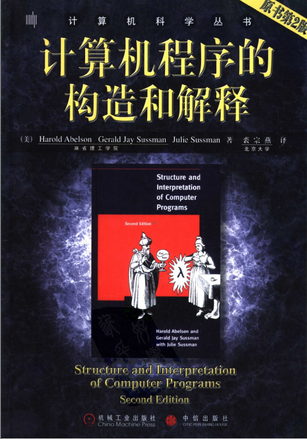

    

>《计算机程序的构造和解释》（英语：Structure and Interpretation of Computer Programs，SICP）是一本关于计算机程序设计的总体性观念的基础教科书，由`MIT press`与`McGraw-Hill`共同出版营销。作者是麻省理工学院的教授哈尔·阿伯尔森、杰拉德·杰伊·萨斯曼，此外杰拉德·杰伊·萨斯曼的妻子`Julie Sussman`也有参与本书的制作。封底的作者图像是由其实验室的同僚`Nick Papadakis`后制的合成照。书中使用程序设计语言`Lisp`的方言`Scheme`来解释计算机科学的核心概念，包括抽象（`abstraction`），递归（`recursion`），解释器（`interpreters`），以及元语言抽象(`metalinguistic abstraction`）。具体而微地由宏观到微观给出清楚地轮廓与脉络。
